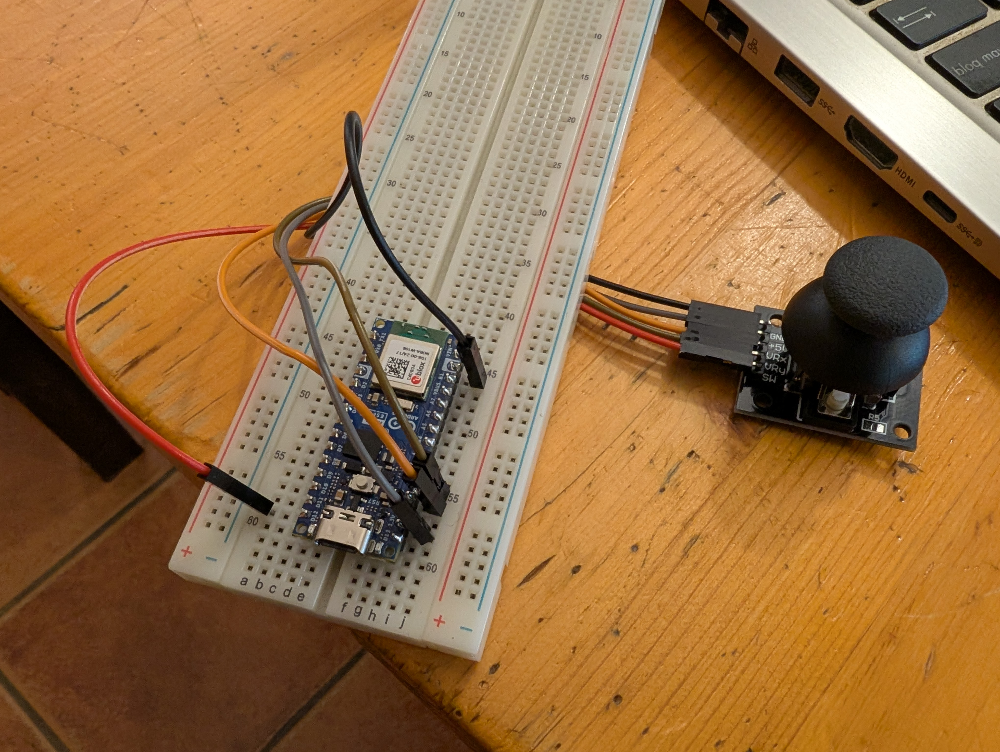
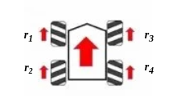

# Proyecto

RoverC Pro controlado con un joysitck usando MicroPython.

## Interfaz de comunicación

El sistema configura una red WiFi con SSID `roverc.pro` y contraseña `roverc.pro`.
Después, se lanza un socket UDP escuchando en el puerto `1234` y procesando comandos
de 7 bytes.

El dato que se envía tiene el siguiente formato:

| `Count` (4 bytes) | `X` coord (signed byte) | `Y` coord (signed byte) | Button pressed (1 byte) |
|-------------------|-------------------------|-------------------------|-------------------------|

El valor `Count` se usa para ignorar posibles paquetes que lleguen desordenados.

## Interfaz Joycon

El joycon está controlado con MicroPython y un ESP32 Nano. El código lee periódicamente
los valores del ADC (cada $10 ms$) y los transmite al remoto.

En segundo plano, una tarea comprueba continuamente si todavía se está conectado al
RoverC.Pro. En caso contrario, el bucle principal se detiene hasta que se recupera
la conexión con el vehículo.

El conexionado es el siguiente:

| **Joystick**   | `GND` | `+5V` | `VRx` | `VRy` | `SW`  |
|----------------|-------|-------|-------|-------|-------|
| **ESP32 Nano** | `GND` | `3V3` | `A0`  | `A1`  | `D12` |

> *NOTA*: aunque la conexión del joycon pone `+5V`, funciona correctamente con `3V3`.

### Problemas conocidos

- La detección del eje $Y$ está invertida. No funciona correctamente en según qué
  posiciones.

- Cuando el RoverC Pro se desconecta, los paquetes UDP se acumulan en la interfaz
  de red hardware, causando `ENOMEM`.

## Estudio matemático

El joystick proporciona valores de coordenadas $X, Y$ cuyo rango se encuentra, una
vez normalizado, comprendido entre $[-127, 127]$ para cada eje.

El vehículo M5Stack sobre el que se han realizado las pruebas cuenta con cuatro
ruedas: $r_1, r_2, r_3, r_4$ correspondientes a delantera izquierda, delantera
derecha, trasera izquierda, trasera derecha:

El cálculo de las rotaciones de cada motor viene determinado por:

$$\begin{pmatrix}
    r_1 \\
    r_2 \\
    r_3 \\
    r_4 \\
\end{pmatrix} = \begin{pmatrix}
    1 \\
    -1 \\
    -1 \\
    1 \\
\end{pmatrix} \cdot Nx + \begin{pmatrix}
    1 \\
    1 \\
    1 \\
    1 \\
\end{pmatrix} \cdot Ny$$

donde:

- $N$ es el factor de normalización.
- $x$ es la coordenada $X$ recibida desde el joystick, con $x \in [-127, 127]$.
- $y$ es la coordenada $Y$ recibida desde el joystick, con $y \in [-127, 127]$.

El factor de normalización se calcula teniendo en cuenta $r$ (la distancia euclídea
de las coordenadas $\left(x, y\right)$ con respecto al origen) y la posición máxima
en el vector director $\vec{r}$.

Para calcularlo, el proceso es muy simple:

1. Se obtiene $c'$ que referencia a la coordenada más próxima al límite, tal que:

$$ c' = max\left(\left|x\right|, \left|y\right|\right) $$

2. A partir de $c'$ se obtiene el factor de normalización $k$. Como
   el joystick produce coordenadas $X, Y$ en un cuadrado el factor es común a ambos
   ejes:

$$ k = \frac{X_{max}}{c'} = \frac{127}{c'} $$

3. Se puede obtener por consiguiente tanto $r$ y $r_{max}$, tal que:

$$\begin{aligned}
    r       &= \sqrt{x^2 + y^2} \\
    r_{max} &= \sqrt{\left(x \cdot k\right)^2 + \left(y \cdot k\right)^2}
\end{aligned}$$

4. Finalmente, se define el factor de normalización $N$ como $r$ sobre $r_{max}$:

$$ N = \frac{r}{r_{max}},\space N \in \left[0, 1\right] $$

### Particularidad RoverC Pro

El RoverC Pro interpreta los giros de rueda de la siguiente manera:

- $v \in \left[0, 128\right)$, $v$ representa una aceleración positiva en el eje.
- $v \in \left(256, 128\right]$, $v$ representa una aceleración negativa en el eje.

Por ende, para una coordenada $c$ que se quiera convertir a aceleración $v$:

$$

\left\{
    \begin{aligned}
        v &= -255 + c \cdot 128^{-1} &,\space c \lt 0 \\
        v &= c \cdot 128^{-1}        &,\space c \ge 0 \\
    \end{aligned}
\right.

$$
